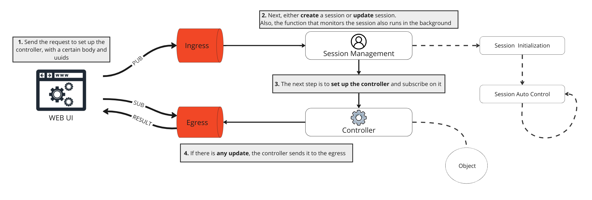

# UI Lib

This is a complete set of [Stateful Functions](https://github.com/foliagecp/sdk/blob/main/docs/glossary.md#stateful-functions-statefun) for working with web clients that use [Foliage](https://foliage.dev/)

[![License][License-Image]][License-Url] [](https://github.com/foliagecp/ui-app-lib/actions/workflows/golangci-ling.yml)

[License-Url]: https://www.apache.org/licenses/LICENSE-2.0
[License-Image]: https://img.shields.io/badge/License-Apache2-blue.svg

## Work Flow


More detailed and complete scheme you can find [here](./docs/detailed.md)

## Get Started

1. Import the following package:
```go
   import uilib "github.com/foliagecp/ui-app-lib"
```

2. Register uilib functions to your Foliage Runtime
```go
    runtime, err := statefun.NewRuntime(runtimeCfg)
    if err != nil {
        ...
    }

    uilib.RegisterAllFunctionTypes(runtime)
```

3. Just start Foliage Runtime
```go
    runtime.Start(cacheCfg, nil)
```

4. Prepare JSON and generate some ID 
```json
{
    "payload":{
        "command": "info"
    }
}
```

5. Send request to ```ui.ingress.<YOUR_ID>``` NATS topic via [nats cli](https://github.com/nats-io/natscli) or from [js](https://github.com/nats-io/nats.ws) with our JSON

6. Subscribe on ```ui.egress.<YOUR_ID>``` and listen result:
```json
{
  "client_id": "uuid",
  "creation_time": 1695292826803661600,
  "inactivity_timeout": "15m0s",
  "last_activity_time": 1695292826803661600,
  "life_time": 86400000000000
}
```

## License

Unless otherwise noted, the easyjson source files are distributed under the Apache Version 2.0 license found in the LICENSE file.

## Contribution

Contributions and bug reports are welcome! Please submit issues or pull requests to help improve this package.
